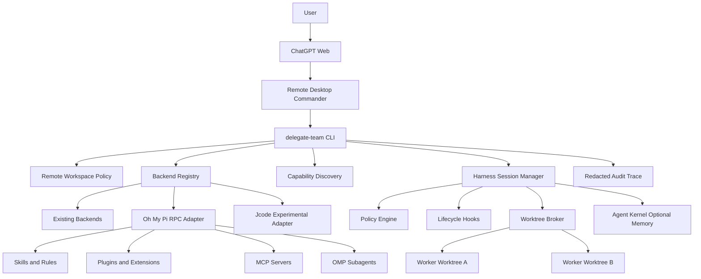

# Terminal Harness End-to-End Implementation Plan

> **For agentic workers:** REQUIRED SUB-SKILL: Use superpowers:subagent-driven-development (recommended) or superpowers:executing-plans to implement this plan task-by-task. Steps use checkbox (`- [ ]`) syntax for tracking.

**Goal:** Extend `delegate-team` into an on-demand local terminal harness that ChatGPT can operate through Remote Desktop Commander, with discoverable backends, governed sessions, skills, tools, hooks, plugins, memory, isolated subagents, and repeatable validation.

**Architecture:** Keep Remote Desktop Commander as the user-approved transport between ChatGPT and the local machine. Keep `delegate-team` as the control plane and introduce typed backend adapters, a runtime registry, a governed harness session manager, and worktree-isolated delegation. Use Oh My Pi as the first full harness backend through its RPC mode, keep the current backends compatible during migration, and add Jcode only as an experimental adapter after the primary path is stable.

**Tech Stack:** TypeScript, Node.js 24+, Commander, Vitest, JSON Schema, child processes, NDJSON over stdio, Git worktrees, Python 3.10+ for existing MMAS components, Bash 4+, Remote Desktop Commander, Oh My Pi RPC, optional Agent Kernel integration.

## Global Constraints

- Work in PR-only mode. Never push directly to `master`, merge a PR, enable auto-merge, publish npm, create a release, or create a tag as part of implementation.
- Preserve the current `dt` CLI behavior unless a task explicitly introduces a backward-compatible extension.
- Remote Desktop Commander remains the transport in the first production release. Do not introduce a public listener, webhook, remote task API, or unauthenticated network port.
- All local harness commands that benefit automation must support stable JSON output.
- Default permissions remain deny-by-default for dependency installation, deletion, commit, push, merge, publish, system changes, and secret reads.
- Never read, print, serialize, log, or commit tokens, browser sessions, cookies, keychain values, API keys, passwords, private keys, `.env` contents, or credential files.
- Do not auto-install coding-agent CLIs. Detect them, report the official setup requirement, and require explicit user approval before persistent installation.
- Pin external harness versions in configuration and test against known versions. Do not silently track `latest` in production behavior.
- A backend response is untrusted input. Review diffs and rerun project checks independently before accepting delegated work.
- Maximum default subagents: 4. Hard maximum: 8. Default recursion depth: 1.
- One writing agent per Git worktree. Never allow sibling workers to write to the same checkout concurrently.
- Do not hand-edit `dist/`. Build output is generated by repository scripts.
- All changes require focused tests before migration of existing behavior.
- Node.js 24+, Python 3.10+, and Bash 4+ remain the supported runtime floors.

---

## 1. Product Definition

### 1.1 Problem

ChatGPT can already reach a local computer through Remote Desktop Commander and can already call `dt` commands. The missing layer is a stable, machine-readable harness contract that makes advanced local capabilities available on demand without forcing ChatGPT to understand the private command syntax of every coding agent.

Today, backend selection and execution are spread across command handlers, relay scripts, the neural mesh, fallback tables, and agent-specific folders. This makes a new backend costly to add and makes long-running interactive harness sessions difficult to govern consistently.

### 1.2 Target User Experience

After the user connects Remote Desktop Commander and approves a workspace, ChatGPT can run:

```bash
dt remote harness doctor --json
dt remote harness discover "/absolute/path/to/project" --json
dt remote harness start "/absolute/path/to/project" --backend omp --profile pr-only --json
dt remote harness prompt <session-id> --message "Inspect the repository and propose the smallest verified fix" --json
dt remote harness status <session-id> --json
dt remote harness stop <session-id> --json
```

The discovery result tells ChatGPT which capabilities are present and which are merely available but disabled:

```json
{
  "ready": true,
  "workspaceRoot": "/absolute/path/to/project",
  "repository": {
    "isGitRepository": true,
    "defaultBranch": "master",
    "currentBranch": "feature/example",
    "dirty": false
  },
  "backends": [
    {
      "id": "omp",
      "installed": true,
      "version": "17.0.6",
      "healthy": true,
      "capabilities": ["rpc", "streaming", "subagents", "skills", "plugins", "mcp", "memory"]
    }
  ],
  "skills": {
    "approved": ["repository-discovery", "validation-and-ci"],
    "untrusted": [],
    "disabled": []
  },
  "policy": {
    "profile": "pr-only",
    "allowCommit": true,
    "allowPush": true,
    "allowMerge": false,
    "allowPublish": false,
    "allowSecretRead": false
  }
}
```

### 1.3 Primary Acceptance Criteria

The production-ready first release is complete when all of the following are true:

1. A new backend can be added through one adapter registration path without editing unrelated commands.
2. Existing `dt run` backend behavior remains compatible and is covered by migration tests.
3. `omp` can be detected, health-checked, started in RPC mode, prompted, streamed, aborted, and stopped through typed code.
4. Remote harness sessions stay inside the canonical workspace root and enforce the stored Remote Agent policy.
5. Session state is persisted locally without storing credentials or full model reasoning traces.
6. Runtime discovery reports skills, plugins, hooks, MCP configurations, Git state, test commands, and available backends without executing unapproved content.
7. Subagents use isolated worktrees and cannot exceed configured worker or recursion limits.
8. Every session produces a redacted audit trace with lifecycle events, selected backend, commands, exit statuses, durations, and validation results.
9. Unit, contract, integration, security, failure-mode, package, and manual macOS tests pass.
10. The feature remains usable through Remote Desktop Commander without adding a daemon or public service.

### 1.4 Non-Goals for the First Release

- Replacing Remote Desktop Commander.
- Building a new language model provider.
- Reimplementing Oh My Pi internals.
- Making Jcode the default backend.
- Allowing autonomous npm publishing, releases, merges, or default-branch pushes.
- Loading every discovered skill, plugin, hook, or MCP server automatically.
- Running unlimited recursive agent swarms.
- Sharing browser authentication, ChatGPT cookies, or local credential stores.
- Providing a hosted multi-tenant harness service.

---

## 2. Architecture



### 2.1 Responsibility Boundaries

| Unit | Responsibility | Must not do |
|---|---|---|
| Remote Desktop Commander | User-approved terminal and filesystem transport | Decide backend policy or persist harness state |
| `dt remote` | Workspace setup, policy, onboarding, and harness entry points | Read credentials or bypass user approvals |
| Backend registry | Locate adapters and resolve IDs and aliases | Execute a task directly |
| Backend adapter | Detect, health-check, dispatch, and manage backend-specific sessions | Change global policy or Git branch rules |
| Harness session manager | Own process lifecycle, session state, prompts, events, cancellation, and cleanup | Parse backend-specific protocols outside adapters |
| Policy engine | Decide whether an operation is allowed, denied, or approval-required | Execute the operation |
| Worktree broker | Create, lease, inspect, and remove isolated worker worktrees | Merge worker changes automatically |
| Discovery service | Report capabilities and configuration candidates | Auto-load untrusted capabilities |
| Audit service | Persist redacted structured events | Store raw credentials or private reasoning |
| Agent Kernel bridge | Read approved memory and write reviewed episodes | Become a hard dependency for core commands |

### 2.2 Data Flow

1. ChatGPT calls `dt remote harness doctor --json` through Remote Desktop Commander.
2. `dt` reads the canonical workspace metadata and policy created by `dt remote init`.
3. Discovery probes executables with bounded timeouts and reads approved metadata files without loading code.
4. The registry selects the requested backend adapter.
5. The policy engine validates the profile, workspace, branch, and requested capabilities.
6. The session manager starts the backend process with a minimal environment and workspace-bound `cwd`.
7. The adapter converts the backend protocol into normalized harness events.
8. Audit logging redacts sensitive fields before local persistence.
9. When delegation is requested, the worktree broker creates one isolated checkout per writer.
10. Parent control reviews worker output, imports selected changes explicitly, and reruns repository checks.
11. Stop, timeout, abort, or process exit triggers deterministic cleanup.

---

## 3. Public CLI Contract

### 3.1 Backend Commands

```bash
dt backends list [--json]
dt backends doctor [backend] [--json]
dt backends describe <backend> [--json]
```

### 3.2 Harness Commands

```bash
dt remote harness doctor [project] [--json]
dt remote harness discover [project] [--json]
dt remote harness start [project] --backend <id> [--profile <id>] [--json]
dt remote harness prompt <session-id> --message <text> [--json]
dt remote harness events <session-id> [--after <sequence>] [--json]
dt remote harness status <session-id> [--json]
dt remote harness abort <session-id> [--json]
dt remote harness stop <session-id> [--json]
dt remote harness cleanup [project] [--stale-after <seconds>] [--json]
```

### 3.3 Subagent Commands

```bash
dt remote harness delegate <session-id> \
  --role <role> \
  --task <text> \
  [--backend <id>] \
  [--max-workers <number>] \
  [--json]

dt remote harness workers <session-id> [--json]
dt remote harness worker-diff <session-id> <worker-id> [--json]
dt remote harness worker-stop <session-id> <worker-id> [--json]
```

### 3.4 Exit Codes

Use the repository `ExitCode` enum and add explicit harness mappings:

| Condition | Exit code behavior |
|---|---|
| Invalid CLI usage | `ExitCode.USAGE` |
| Missing backend executable | `ExitCode.MISSING_DEPENDENCY` |
| Policy denial | `ExitCode.PERMISSION_DENIED` if present, otherwise add it once with tests |
| Backend protocol failure | `ExitCode.FAILURE` |
| Timeout | Add a stable timeout exit code if the enum does not already have one |
| User abort | Add a stable cancelled exit code if the enum does not already have one |
| Successful command | `0` |

---

## 4. Target File Structure

The implementation should converge on this structure without moving unrelated files:

```text
src/
  backends/
    types.ts
    registry.ts
    legacy-relay-adapter.ts
    model-registry.ts
    fallback-policy.ts
    omp/
      adapter.ts
      protocol.ts
      process.ts
      discovery.ts
    jcode/
      adapter.ts
      discovery.ts
  harness/
    types.ts
    profiles.ts
    policy-engine.ts
    discovery.ts
    session-store.ts
    session-manager.ts
    audit.ts
    hooks.ts
    worktrees.ts
    redaction.ts
  commands/
    backends.ts
    remote.ts
  remote/
    types.ts
    workspace.ts
    agents.ts
    prompts.ts
  schemas/
    routing-trace.schema.json
    harness-session.schema.json
    harness-event.schema.json

tests/
  backends/
    registry.test.ts
    legacy-relay-adapter.test.ts
    model-registry.test.ts
    fallback-policy.test.ts
    omp-adapter.test.ts
    omp-process.test.ts
    omp-contract.test.ts
    jcode-adapter.test.ts
  harness/
    profiles.test.ts
    policy-engine.test.ts
    discovery.test.ts
    session-store.test.ts
    session-manager.test.ts
    audit.test.ts
    hooks.test.ts
    worktrees.test.ts
    security.test.ts
    fault-injection.test.ts
  fixtures/
    fake-omp.mjs
    fake-jcode.mjs
    fake-backend.mjs
    repositories/
  remote-agent.test.ts
  package-smoke.test.ts

docs/
  TERMINAL-HARNESS.md
  SECURITY-MODEL.md
  ARCHITECTURE.md
  INSTALLATION.md
```

---

## 5. Core Interfaces

### 5.1 Backend Adapter

Create `src/backends/types.ts`:

```ts
export type BackendCapability =
  | 'batch'
  | 'rpc'
  | 'streaming'
  | 'sessions'
  | 'subagents'
  | 'skills'
  | 'plugins'
  | 'hooks'
  | 'mcp'
  | 'memory'
  | 'worktrees';

export type BackendDetection = {
  id: string;
  installed: boolean;
  executable: string | null;
  version: string | null;
  capabilities: BackendCapability[];
};

export type BackendHealth = {
  healthy: boolean;
  authenticated: 'ready' | 'required' | 'unknown';
  warnings: string[];
  checks: Array<{
    id: string;
    ok: boolean;
    detail: string;
  }>;
};

export type DispatchRequest = {
  task: string;
  workspaceRoot: string;
  model?: string;
  timeoutMs: number;
  environment: Record<string, string>;
  metadata: Record<string, string | number | boolean>;
};

export type BackendEvent = {
  sequence: number;
  timestamp: string;
  type:
    | 'session.started'
    | 'response.delta'
    | 'response.completed'
    | 'tool.started'
    | 'tool.completed'
    | 'worker.started'
    | 'worker.completed'
    | 'warning'
    | 'error'
    | 'session.stopped';
  payload: Record<string, unknown>;
};

export type BackendResult = {
  ok: boolean;
  exitCode: number;
  summary: string;
  durationMs: number;
  warnings: string[];
};

export type BackendSession = {
  id: string;
  prompt(message: string): AsyncIterable<BackendEvent>;
  abort(): Promise<void>;
  stop(): Promise<void>;
};

export interface BackendAdapter {
  readonly id: string;
  readonly label: string;
  readonly capabilities: BackendCapability[];
  detect(): Promise<BackendDetection>;
  health(): Promise<BackendHealth>;
  dispatch(request: DispatchRequest): Promise<BackendResult>;
  startSession?(request: DispatchRequest): Promise<BackendSession>;
  configHints(): string[];
}
```

### 5.2 Harness Types

Create `src/harness/types.ts`:

```ts
import type { BackendCapability, BackendEvent } from '../backends/types.js';

export type HarnessProfileId = 'strict' | 'pr-only' | 'agency' | 'oss-maintainer';

export type HarnessProfile = {
  id: HarnessProfileId;
  allowDependencyInstall: boolean;
  allowDelete: boolean;
  allowCommit: boolean;
  allowPush: boolean;
  allowMerge: boolean;
  allowPublish: boolean;
  allowSystemChanges: boolean;
  allowSecretRead: boolean;
  requireFeatureBranch: boolean;
  requireBaselineTests: boolean;
  requireFinalVerification: boolean;
  requireDiffReview: boolean;
  maxWorkers: number;
  maxRecursionDepth: number;
};

export type HarnessSessionRecord = {
  schema: 'delegate-team.harness-session.v1';
  id: string;
  workspaceRoot: string;
  backendId: string;
  backendVersion: string | null;
  profileId: HarnessProfileId;
  status: 'starting' | 'running' | 'aborting' | 'stopping' | 'stopped' | 'failed';
  processId: number | null;
  startedAt: string;
  updatedAt: string;
  stoppedAt: string | null;
  lastEventSequence: number;
};

export type HarnessDiscoveryReport = {
  ready: boolean;
  workspaceRoot: string;
  repository: {
    isGitRepository: boolean;
    defaultBranch: string | null;
    currentBranch: string | null;
    dirty: boolean;
  };
  backends: Array<{
    id: string;
    installed: boolean;
    version: string | null;
    healthy: boolean;
    capabilities: BackendCapability[];
    warnings: string[];
  }>;
  skills: {
    approved: string[];
    untrusted: string[];
    disabled: string[];
  };
  hooks: string[];
  plugins: string[];
  mcpServers: Array<{ name: string; enabled: boolean; source: string }>;
  testCommands: string[];
};

export type HarnessEventRecord = BackendEvent & {
  schema: 'delegate-team.harness-event.v1';
  sessionId: string;
  backendId: string;
};
```

---

## 6. Pull Request Delivery Program

Implement this plan as a sequence of focused pull requests. Do not combine the program into one branch.

| PR | Theme | Dependency | Production effect |
|---|---|---|---|
| 1 | Backend contracts and registry | None | No behavior change |
| 2 | Model registry, trace schema, and fallback policy | PR 1 | Internal routing source of truth |
| 3 | Legacy backend migration | PR 1 and PR 2 | Existing `dt run` uses adapters |
| 4 | Backend inspection commands | PR 3 | Adds `dt backends` |
| 5 | OMP detection and batch adapter | PR 4 | Adds explicit `--backend omp` batch path |
| 6 | OMP RPC session runtime | PR 5 | Adds persistent local harness sessions |
| 7 | Harness profiles, policy engine, and audit | PR 6 | Governs session actions |
| 8 | Workspace capability discovery | PR 7 | Adds machine-readable discovery |
| 9 | Remote harness CLI | PR 8 | Connects ChatGPT flow end-to-end |
| 10 | Worktree-isolated subagents | PR 9 | Adds governed delegation |
| 11 | Agent Kernel bridge and lifecycle hooks | PR 10 | Adds optional memory and approvals |
| 12 | Jcode experimental adapter | PR 9 | Optional non-default runtime |
| 13 | Documentation, package checks, and release readiness | All required production PRs | Completes supported rollout |

---

### Task 1: Establish Baseline and Regression Fixtures

**Files:**
- Modify: `tests/remote-agent.test.ts`
- Create: `tests/fixtures/fake-backend.mjs`
- Create: `tests/fixtures/repositories/minimal/package.json`
- Create: `tests/fixtures/repositories/minimal/.gitignore`

**Interfaces:**
- Consumes: current `runDispatch`, `registerRemoteCommands`, and existing test helpers.
- Produces: deterministic child-process fixture conventions reused by later adapter and harness tests.

- [ ] **Step 1: Add baseline CLI assertions before refactoring**

Add tests that lock the current public behaviors:

```ts
it('keeps remote bootstrap, init, status, prompt, agents, and doctor registered', () => {
  const output = runCli(['remote', '--help']);
  expect(output.stdout).toContain('bootstrap');
  expect(output.stdout).toContain('init');
  expect(output.stdout).toContain('status');
  expect(output.stdout).toContain('prompt');
  expect(output.stdout).toContain('agents');
  expect(output.stdout).toContain('doctor');
});
```

- [ ] **Step 2: Add a fake backend process fixture**

Create `tests/fixtures/fake-backend.mjs`:

```js
#!/usr/bin/env node
const args = process.argv.slice(2);

if (args.includes('--version')) {
  process.stdout.write('fake-backend 1.0.0\n');
  process.exit(0);
}

const mode = process.env.FAKE_BACKEND_MODE || 'success';
if (mode === 'timeout') {
  setInterval(() => {}, 1000);
} else if (mode === 'failure') {
  process.stderr.write('controlled failure\n');
  process.exit(2);
} else {
  process.stdout.write('controlled success\n');
  process.exit(0);
}
```

- [ ] **Step 3: Run the focused baseline tests**

Run:

```bash
npm run build
npx vitest run tests/remote-agent.test.ts
```

Expected: all existing and new tests pass.

- [ ] **Step 4: Commit the baseline**

```bash
git add tests/remote-agent.test.ts tests/fixtures

git commit -m "test: lock remote agent baseline"
```

---

### Task 2: Add Backend Contracts and Registry

**Files:**
- Create: `src/backends/types.ts`
- Create: `src/backends/registry.ts`
- Create: `tests/backends/registry.test.ts`
- Modify: `src/cli.ts`

**Interfaces:**
- Consumes: no runtime-specific code.
- Produces: `BackendAdapter`, `BackendRegistry`, `registerBackend`, `getBackend`, and `listBackends`.

- [ ] **Step 1: Write failing registry tests**

```ts
import { describe, expect, it } from 'vitest';
import { BackendRegistry } from '../../src/backends/registry.js';
import type { BackendAdapter } from '../../src/backends/types.js';

const adapter = (id: string): BackendAdapter => ({
  id,
  label: id.toUpperCase(),
  capabilities: ['batch'],
  async detect() {
    return { id, installed: true, executable: id, version: '1.0.0', capabilities: ['batch'] };
  },
  async health() {
    return { healthy: true, authenticated: 'unknown', warnings: [], checks: [] };
  },
  async dispatch() {
    return { ok: true, exitCode: 0, summary: 'ok', durationMs: 1, warnings: [] };
  },
  configHints() {
    return [];
  },
});

describe('BackendRegistry', () => {
  it('registers and resolves one adapter by canonical id', () => {
    const registry = new BackendRegistry();
    registry.register(adapter('omp'));
    expect(registry.get('omp')?.id).toBe('omp');
  });

  it('rejects duplicate ids', () => {
    const registry = new BackendRegistry();
    registry.register(adapter('omp'));
    expect(() => registry.register(adapter('omp'))).toThrow(/already registered/i);
  });
});
```

- [ ] **Step 2: Run the test and verify failure**

```bash
npx vitest run tests/backends/registry.test.ts
```

Expected: failure because `BackendRegistry` does not exist.

- [ ] **Step 3: Implement the registry**

```ts
import type { BackendAdapter } from './types.js';

export class BackendRegistry {
  readonly #adapters = new Map<string, BackendAdapter>();

  register(adapter: BackendAdapter): void {
    if (this.#adapters.has(adapter.id)) {
      throw new Error(`Backend already registered: ${adapter.id}`);
    }
    this.#adapters.set(adapter.id, adapter);
  }

  get(id: string): BackendAdapter | undefined {
    return this.#adapters.get(id);
  }

  list(): BackendAdapter[] {
    return [...this.#adapters.values()].sort((left, right) => left.id.localeCompare(right.id));
  }
}
```

- [ ] **Step 4: Export a production registry factory**

Create a factory in `src/backends/registry.ts` that accepts an adapter array rather than importing every implementation through hidden side effects:

```ts
export function createBackendRegistry(adapters: BackendAdapter[]): BackendRegistry {
  const registry = new BackendRegistry();
  for (const adapter of adapters) registry.register(adapter);
  return registry;
}
```

- [ ] **Step 5: Run tests and type checking**

```bash
npx vitest run tests/backends/registry.test.ts
npm run typecheck
```

Expected: pass.

- [ ] **Step 6: Commit**

```bash
git add src/backends tests/backends/registry.test.ts src/cli.ts

git commit -m "feat(backends): add adapter contracts and registry"
```

---

### Task 3: Centralize Model Registry, Routing Trace, and Fallback Policy

**Files:**
- Create: `src/backends/model-registry.ts`
- Create: `src/backends/fallback-policy.ts`
- Create: `src/schemas/routing-trace.schema.json`
- Create: `tests/backends/model-registry.test.ts`
- Create: `tests/backends/fallback-policy.test.ts`
- Modify: `src/commands/run.ts`
- Modify: `src/fallback/ring.ts`
- Modify: `neural-mesh.json`

**Interfaces:**
- Consumes: backend IDs from `BackendRegistry` and existing neural mesh fallback data.
- Produces: `resolveModelAlias`, `resolveFallbackChain`, `RoutingTraceV1`, and one validated source of routing decisions.

- [ ] **Step 1: Define a versioned model registry**

```ts
export type ModelRegistryV1 = {
  schema: 'delegate-team.model-registry.v1';
  aliases: Record<string, { backend: string; model: string }>;
};

export function resolveModelAlias(
  registry: ModelRegistryV1,
  alias: string,
): { backend: string; model: string } | null {
  return registry.aliases[alias] ?? null;
}
```

Allow user overrides only from a private local config file under `~/.config/dt/` and validate the schema before merging. Local entries override built-ins by alias; malformed entries fail closed with a redacted warning.

- [ ] **Step 2: Define one fallback policy API**

```ts
export type FallbackPolicy = {
  name: 'default' | 'strict';
  chainFor(backendId: string): string[];
};
```

`default` may consult the neural mesh and then the repository fallback ring. `strict` returns no automatic fallback and requires the caller to handle failure explicitly.

- [ ] **Step 3: Define the trace schema**

The JSON schema must require:

```json
{
  "schema": "delegate-team.routing-trace.v1",
  "task": "string",
  "signals": {},
  "selectedWorkflow": "string",
  "selectedBackend": "string",
  "confidence": 0.0,
  "reasons": [],
  "warnings": [],
  "fallbackReason": null,
  "startedAt": "ISO-8601",
  "completedAt": "ISO-8601"
}
```

- [ ] **Step 4: Add tests before migrating `runDispatch`**

Tests must cover:

- built-in model alias resolution
- local override precedence
- malformed local registry rejection
- mesh-driven fallback
- ring fallback when mesh loading fails
- strict policy returning an empty chain
- trace validation success and missing-field failure

- [ ] **Step 5: Replace duplicated fallback use in `runDispatch`**

`runDispatch` currently calculates a planned chain through one path and executes another path. Replace both with one call to `resolveFallbackChain` so dry-run output and execution use the same chain.

- [ ] **Step 6: Verify**

```bash
npx vitest run tests/backends/model-registry.test.ts tests/backends/fallback-policy.test.ts
npm run typecheck
npm run lint
```

Expected: pass with no unexplained hardcoded model aliases in command handlers.

- [ ] **Step 7: Commit**

```bash
git add src/backends src/schemas src/commands/run.ts src/fallback/ring.ts neural-mesh.json tests/backends

git commit -m "refactor(routing): centralize models traces and fallback policy"
```

---

### Task 4: Wrap Existing Relay Backends in an Adapter

**Files:**
- Create: `src/backends/legacy-relay-adapter.ts`
- Create: `tests/backends/legacy-relay-adapter.test.ts`
- Modify: `src/commands/run.ts`
- Modify: `src/config/runtime-paths.ts`

**Interfaces:**
- Consumes: `BackendAdapter`, existing `relay.mjs`, current brief format, and fallback policy.
- Produces: adapters for current relay-backed IDs without changing user-facing backend names.

- [ ] **Step 1: Write contract tests for each existing backend ID**

The registry must expose current canonical IDs and aliases used by the CLI and mesh. Tests should derive the expected list from current repository configuration instead of inventing new names.

- [ ] **Step 2: Implement `LegacyRelayAdapter`**

```ts
export class LegacyRelayAdapter implements BackendAdapter {
  readonly capabilities = ['batch'] as const;

  constructor(
    readonly id: string,
    readonly label: string,
    private readonly relayScript: string,
  ) {}

  async detect(): Promise<BackendDetection> {
    return {
      id: this.id,
      installed: existsSync(this.relayScript),
      executable: this.relayScript,
      version: null,
      capabilities: [...this.capabilities],
    };
  }

  async dispatch(request: DispatchRequest): Promise<BackendResult> {
    const startedAt = Date.now();
    const result = spawnSync(process.execPath, [this.relayScript, '--backend', this.id], {
      cwd: request.workspaceRoot,
      input: request.task,
      encoding: 'utf8',
      timeout: request.timeoutMs,
      env: request.environment,
    });

    return {
      ok: result.status === 0,
      exitCode: result.status ?? 1,
      summary: result.status === 0 ? 'completed' : 'failed',
      durationMs: Date.now() - startedAt,
      warnings: [],
    };
  }

  async health(): Promise<BackendHealth> {
    const detection = await this.detect();
    return {
      healthy: detection.installed,
      authenticated: 'unknown',
      warnings: detection.installed ? [] : ['relay script is missing'],
      checks: [{ id: 'relay-script', ok: detection.installed, detail: detection.executable ?? 'missing' }],
    };
  }

  configHints(): string[] {
    return [];
  }
}
```

The final implementation must preserve the current brief-file contract if relay requires it. Do not silently change stdin behavior without a fixture proving parity.

- [ ] **Step 3: Migrate `runDispatch` to registry-based dispatch**

Keep the special MMAS and MetaGPT paths until they receive their own adapters. Move only relay-backed execution in this PR.

- [ ] **Step 4: Run parity tests**

```bash
npx vitest run tests/backends/legacy-relay-adapter.test.ts tests/remote-agent.test.ts
npm test
```

Expected: all existing dispatch tests and package shell tests pass.

- [ ] **Step 5: Commit**

```bash
git add src/backends src/commands/run.ts src/config tests/backends tests/remote-agent.test.ts

git commit -m "refactor(backends): route legacy relays through adapters"
```

---

### Task 5: Add Backend Inspection Commands

**Files:**
- Create: `src/commands/backends.ts`
- Create: `tests/backends/commands.test.ts`
- Modify: `src/cli.ts`

**Interfaces:**
- Consumes: production `BackendRegistry`.
- Produces: `dt backends list`, `dt backends doctor`, and `dt backends describe`.

- [ ] **Step 1: Add failing CLI tests**

```ts
it('prints stable JSON for backend discovery', async () => {
  const result = runCli(['backends', 'list', '--json']);
  const body = JSON.parse(result.stdout);
  expect(Array.isArray(body.backends)).toBe(true);
  expect(body.backends[0]).toHaveProperty('id');
  expect(body.backends[0]).toHaveProperty('installed');
  expect(body.backends[0]).toHaveProperty('capabilities');
});
```

- [ ] **Step 2: Implement command registration**

JSON must use this shape:

```ts
type BackendsListOutput = {
  schema: 'delegate-team.backends-list.v1';
  backends: Array<BackendDetection & { label: string }>;
};
```

- [ ] **Step 3: Add bounded concurrent health checks**

Run health checks with a small concurrency limit and per-backend timeout. A broken optional backend must be reported as unhealthy without crashing the entire list.

- [ ] **Step 4: Verify**

```bash
npx vitest run tests/backends/commands.test.ts
npm run build
dt backends list --json
```

Expected: valid JSON and exit code 0 even when optional backends are missing.

- [ ] **Step 5: Commit**

```bash
git add src/commands/backends.ts src/cli.ts tests/backends/commands.test.ts

git commit -m "feat(cli): add backend inspection commands"
```

---

### Task 6: Add Oh My Pi Detection and Batch Dispatch

**Files:**
- Create: `src/backends/omp/discovery.ts`
- Create: `src/backends/omp/adapter.ts`
- Create: `tests/backends/omp-adapter.test.ts`
- Create: `tests/fixtures/fake-omp.mjs`
- Modify: `src/backends/registry.ts`
- Modify: `docs/INSTALLATION.md`

**Interfaces:**
- Consumes: backend contracts and executable probing helpers.
- Produces: production adapter ID `omp` with batch dispatch and health reporting.

- [ ] **Step 1: Create a fake OMP executable**

The fixture must support:

```text
--version
--mode rpc --no-session
one-shot prompt execution used by the chosen batch command
controlled timeout, malformed output, non-zero exit, and clean success
```

- [ ] **Step 2: Implement safe executable discovery**

Probe `omp` through `PATH` without shell interpolation. Use a bounded timeout and truncate version output. Never inspect OMP auth files or environment-variable values.

- [ ] **Step 3: Implement health checks**

Required checks:

- executable present
- supported version format
- RPC flag present in `omp --help`
- writable temporary session directory
- authentication status reported only as `ready`, `required`, or `unknown`

- [ ] **Step 4: Implement batch dispatch**

Batch dispatch must use `spawn`, not a shell string. Pass the approved workspace as `cwd`, a minimal environment, and an explicit timeout. Capture bounded stdout and stderr, redact them, and return a normalized result.

- [ ] **Step 5: Add version pin configuration**

Support a user-level configuration field:

```json
{
  "harness": {
    "backends": {
      "omp": {
        "expectedVersion": "17.0.6"
      }
    }
  }
}
```

A mismatch is a warning by default and a failure under the `strict` profile.

- [ ] **Step 6: Verify**

```bash
npx vitest run tests/backends/omp-adapter.test.ts
npm run typecheck
npm run lint
```

Expected: all fake process modes are deterministic and no live OMP installation is required in CI.

- [ ] **Step 7: Commit**

```bash
git add src/backends/omp src/backends/registry.ts tests/backends/omp-adapter.test.ts tests/fixtures/fake-omp.mjs docs/INSTALLATION.md

git commit -m "feat(omp): add detection health and batch adapter"
```

---

### Task 7: Implement Oh My Pi RPC Protocol and Process Lifecycle

**Files:**
- Create: `src/backends/omp/protocol.ts`
- Create: `src/backends/omp/process.ts`
- Modify: `src/backends/omp/adapter.ts`
- Create: `tests/backends/omp-process.test.ts`
- Create: `tests/backends/omp-contract.test.ts`
- Modify: `tests/fixtures/fake-omp.mjs`

**Interfaces:**
- Consumes: OMP NDJSON request and event frames through stdio.
- Produces: `OmpRpcProcess` implementing `BackendSession`.

- [ ] **Step 1: Define protocol types and validators**

```ts
export type OmpRpcCommand =
  | { id: string; type: 'prompt'; message: string }
  | { id: string; type: 'set_model'; provider: string; modelId: string }
  | { id: string; type: 'abort' };

export type OmpRpcFrame = {
  id?: string;
  type: string;
  [key: string]: unknown;
};

export function parseOmpFrame(line: string): OmpRpcFrame {
  const parsed: unknown = JSON.parse(line);
  if (!parsed || typeof parsed !== 'object' || Array.isArray(parsed)) {
    throw new Error('OMP RPC frame must be an object');
  }
  const frame = parsed as Record<string, unknown>;
  if (typeof frame.type !== 'string') {
    throw new Error('OMP RPC frame is missing type');
  }
  return frame as OmpRpcFrame;
}
```

- [ ] **Step 2: Write failure-first process tests**

Tests must cover:

- split NDJSON chunks across stdout reads
- multiple frames in one chunk
- malformed JSON line
- response correlation by request ID
- stderr warning redaction
- child exit before response
- prompt timeout
- abort acknowledgement
- `SIGTERM` followed by bounded `SIGKILL` fallback
- no orphan child after stop

- [ ] **Step 3: Implement `OmpRpcProcess`**

```ts
export class OmpRpcProcess implements BackendSession {
  constructor(
    readonly id: string,
    private readonly child: ChildProcessWithoutNullStreams,
    private readonly timeoutMs: number,
  ) {}

  async *prompt(message: string): AsyncIterable<BackendEvent> {
    // Correlate one request id, stream normalized events, and resolve only on terminal response.
  }

  async abort(): Promise<void> {
    // Send an RPC abort frame and wait for bounded acknowledgement or process exit.
  }

  async stop(): Promise<void> {
    // Close stdin, send SIGTERM, wait for grace, then SIGKILL only if still alive.
  }
}
```

The implementation must use a line buffer, a pending-request map, monotonic event sequence numbers, and one cleanup path for exit, error, abort, timeout, and explicit stop.

- [ ] **Step 4: Start OMP through the adapter**

Use:

```bash
omp --mode rpc --no-session
```

Pass no secret-bearing environment variables beyond an explicit allowlist. Inherit authentication through the backend's normal user configuration without reading it.

- [ ] **Step 5: Verify**

```bash
npx vitest run tests/backends/omp-process.test.ts tests/backends/omp-contract.test.ts
npm run typecheck
```

Expected: deterministic pass and no remaining fake child process after each test.

- [ ] **Step 6: Commit**

```bash
git add src/backends/omp tests/backends/omp-process.test.ts tests/backends/omp-contract.test.ts tests/fixtures/fake-omp.mjs

git commit -m "feat(omp): add governed rpc session lifecycle"
```

---

### Task 8: Add Harness Profiles and Policy Engine

**Files:**
- Create: `src/harness/types.ts`
- Create: `src/harness/profiles.ts`
- Create: `src/harness/policy-engine.ts`
- Create: `tests/harness/profiles.test.ts`
- Create: `tests/harness/policy-engine.test.ts`
- Modify: `src/remote/types.ts`
- Modify: `src/remote/workspace.ts`

**Interfaces:**
- Consumes: existing `RemotePolicy` and requested harness operation.
- Produces: profile resolution and `PolicyDecision` values.

- [ ] **Step 1: Define policy decisions**

```ts
export type HarnessOperation =
  | 'read'
  | 'write'
  | 'delete'
  | 'dependency.install'
  | 'git.branch'
  | 'git.commit'
  | 'git.push'
  | 'git.merge'
  | 'package.publish'
  | 'system.change'
  | 'secret.read'
  | 'backend.start'
  | 'worker.spawn';

export type PolicyDecision = {
  decision: 'allow' | 'deny' | 'approval-required';
  reason: string;
};
```

- [ ] **Step 2: Define immutable built-in profiles**

Required profiles:

- `strict`: read-only, no dependency install, no commit or push, max 1 worker
- `pr-only`: branch, edit, test, commit, and feature-branch push allowed; merge and publish denied; max 4 workers
- `agency`: same as `pr-only` with dependency installation approval-required
- `oss-maintainer`: same as `pr-only` with selected maintenance actions approval-required

Built-ins are code-owned. Project policy may reduce permissions but may not silently increase them above the selected profile.

- [ ] **Step 3: Implement decision precedence**

Use this order:

1. Hard repository security invariants
2. Stored Remote Agent policy
3. Selected harness profile
4. Per-command explicit approval flag
5. Backend capability availability

A deny at a higher layer cannot be overridden lower in the chain.

- [ ] **Step 4: Add tests for every operation and profile**

Include explicit assertions that `pr-only` denies:

```ts
expect(decide('git.merge', context).decision).toBe('deny');
expect(decide('package.publish', context).decision).toBe('deny');
expect(decide('secret.read', context).decision).toBe('deny');
```

- [ ] **Step 5: Verify and commit**

```bash
npx vitest run tests/harness/profiles.test.ts tests/harness/policy-engine.test.ts
npm run typecheck

git add src/harness src/remote tests/harness

git commit -m "feat(harness): add profiles and policy decisions"
```

---

### Task 9: Add Redacted Audit Events and Session Storage

**Files:**
- Create: `src/harness/redaction.ts`
- Create: `src/harness/audit.ts`
- Create: `src/harness/session-store.ts`
- Create: `src/schemas/harness-session.schema.json`
- Create: `src/schemas/harness-event.schema.json`
- Create: `tests/harness/audit.test.ts`
- Create: `tests/harness/session-store.test.ts`

**Interfaces:**
- Consumes: normalized backend and harness events.
- Produces: append-only JSONL audit files and atomic session records under `.delegate-team/`.

- [ ] **Step 1: Define storage locations**

```text
.delegate-team/harness/sessions/<session-id>.json
.delegate-team/harness/events/<session-id>.jsonl
.delegate-team/harness/workers/<session-id>.json
```

Ensure `.delegate-team/.gitignore` ignores session, event, and worker state.

- [ ] **Step 2: Implement recursive redaction**

Redact object keys matching case-insensitive credential categories and redact token-shaped values in strings. Preserve structural debugging information and exit statuses.

```ts
const SENSITIVE_KEY = /(authorization|api[_-]?key|token|password|secret|cookie|private[_-]?key)/i;
```

- [ ] **Step 3: Implement atomic session writes**

Write to a sibling temporary file with mode `0600`, fsync when practical, and rename into place. Parent directories must use private permissions.

- [ ] **Step 4: Implement append-only event persistence**

Each event must include schema, session ID, backend ID, sequence, timestamp, type, and redacted payload. Reject non-monotonic sequence writes.

- [ ] **Step 5: Test security and corruption behavior**

Tests must cover:

- nested secrets
- Bearer token text
- proxy token text
- atomic replacement
- invalid schema rejection
- partial JSON file recovery behavior
- non-monotonic event rejection
- file permission assertions on POSIX systems

- [ ] **Step 6: Verify and commit**

```bash
npx vitest run tests/harness/audit.test.ts tests/harness/session-store.test.ts
npm run typecheck

git add src/harness src/schemas tests/harness .gitignore

git commit -m "feat(harness): add redacted audit and session storage"
```

---

### Task 10: Implement Capability Discovery

**Files:**
- Create: `src/harness/discovery.ts`
- Create: `tests/harness/discovery.test.ts`
- Modify: `src/remote/agents.ts`
- Modify: `src/remote/workspace.ts`

**Interfaces:**
- Consumes: canonical workspace, registry, Remote Policy, and repository metadata files.
- Produces: `HarnessDiscoveryReport`.

- [ ] **Step 1: Define discovery sources**

Inspect metadata only from these approved locations inside the workspace:

```text
AGENTS.md
CLAUDE.md
CHATGPT_REMOTE_AGENT.md
.delegate-team/
.claude/
.codex/
.cursor/
.windsurf/
.gemini/
.cline/
.github/
.vscode/
.mcp.json
package.json
pyproject.toml
Cargo.toml
go.mod
Makefile
```

User-level configuration may be reported only by known filename and enabled state. Do not include file contents or secret values.

- [ ] **Step 2: Classify discovered capabilities**

- approved: repository governance files and explicitly allowlisted skills
- untrusted: externally sourced skills or plugins not allowlisted
- disabled: MCP or plugin entries found but not enabled by policy

- [ ] **Step 3: Detect repository commands**

Extract test, build, lint, typecheck, and package commands from known manifest fields. Do not execute them during discovery.

- [ ] **Step 4: Detect Git state safely**

Use `git` argument arrays with the workspace as `cwd`:

```text
git rev-parse --is-inside-work-tree
git branch --show-current
git status --porcelain
git symbolic-ref refs/remotes/origin/HEAD
```

Do not run hooks during discovery.

- [ ] **Step 5: Add traversal and symlink tests**

Tests must cover:

- project path containing spaces and `#`
- symlink escaping the workspace
- `.env` present but not read
- malicious `SKILL.md` content not executed or returned
- MCP configuration discovered but disabled
- missing Git repository
- malformed package manifest

- [ ] **Step 6: Verify and commit**

```bash
npx vitest run tests/harness/discovery.test.ts
npm run typecheck

git add src/harness/discovery.ts src/remote tests/harness/discovery.test.ts

git commit -m "feat(harness): add safe capability discovery"
```

---

### Task 11: Implement Harness Session Manager

**Files:**
- Create: `src/harness/session-manager.ts`
- Create: `src/harness/hooks.ts`
- Create: `tests/harness/session-manager.test.ts`
- Create: `tests/harness/hooks.test.ts`

**Interfaces:**
- Consumes: registry, adapter sessions, policy engine, session store, and audit service.
- Produces: `start`, `prompt`, `events`, `status`, `abort`, `stop`, and stale cleanup operations.

- [ ] **Step 1: Define session manager dependencies**

```ts
export type SessionManagerDependencies = {
  registry: BackendRegistry;
  store: HarnessSessionStore;
  audit: HarnessAuditLog;
  policy: HarnessPolicyEngine;
  hooks: HarnessHookRunner;
  now: () => Date;
  randomId: () => string;
};
```

- [ ] **Step 2: Define lifecycle hooks**

Supported internal events:

```ts
export type HarnessHookEvent =
  | 'before-session'
  | 'after-discovery'
  | 'before-command'
  | 'before-write'
  | 'after-write'
  | 'before-commit'
  | 'after-commit'
  | 'before-push'
  | 'after-push'
  | 'before-pr'
  | 'after-pr'
  | 'on-failure'
  | 'on-shutdown';
```

The first release ships only built-in hooks. External hooks may be discovered but remain disabled until a separate allowlist design is approved.

- [ ] **Step 3: Implement start behavior**

`start` must:

1. Validate the canonical workspace and stored policy.
2. Resolve the selected profile.
3. Resolve and health-check the backend.
4. Reject unsupported session capability.
5. Write a `starting` record.
6. Start the backend session.
7. Update the record to `running` with PID when available.
8. Emit redacted lifecycle events.
9. Run cleanup on any partial failure.

- [ ] **Step 4: Implement prompt behavior**

Prompt must stream normalized events, persist each event once, update the last sequence atomically, and surface backend errors without losing the audit trail.

- [ ] **Step 5: Implement abort, stop, and cleanup**

- `abort` requests cancellation but leaves the process available if the backend supports continued use.
- `stop` terminates the backend session and marks the record stopped.
- `cleanup` identifies stale records, verifies process identity before signalling, and removes only harness-owned temporary resources.

- [ ] **Step 6: Add concurrency tests**

Test:

- two prompts in sequence
- a rejected overlapping prompt if the backend does not support concurrency
- simultaneous stop and process exit
- timeout followed by stop
- duplicate stop idempotency
- stale PID that belongs to a different process
- session store failure after process start

- [ ] **Step 7: Verify and commit**

```bash
npx vitest run tests/harness/session-manager.test.ts tests/harness/hooks.test.ts
npm run typecheck

git add src/harness tests/harness

git commit -m "feat(harness): add governed session manager"
```

---

### Task 12: Expose Remote Harness CLI

**Files:**
- Modify: `src/commands/remote.ts`
- Create: `tests/harness/remote-harness-cli.test.ts`
- Modify: `src/cli.ts`
- Modify: `src/remote/prompts.ts`

**Interfaces:**
- Consumes: discovery service and session manager.
- Produces: the complete `dt remote harness` CLI contract.

- [ ] **Step 1: Register nested commands**

Add a `harness` child under the existing `remote` command without changing existing subcommands.

- [ ] **Step 2: Implement stable JSON envelopes**

Every JSON response must contain:

```ts
type HarnessCommandEnvelope<T> = {
  schema: 'delegate-team.harness-command.v1';
  ok: boolean;
  command: string;
  data: T | null;
  error: { code: string; message: string } | null;
};
```

Do not mix progress text into stdout when `--json` is active. Human progress and debug details go to stderr.

- [ ] **Step 3: Update the generated ChatGPT project prompt**

The prompt should instruct ChatGPT to:

1. Run harness doctor and discovery first.
2. Respect the stored policy and selected profile.
3. Start only one primary harness session by default.
4. Delegate only when work can be isolated.
5. Review worker diffs and rerun tests independently.
6. Never merge, publish, or read secrets unless separately authorized and permitted.

- [ ] **Step 4: Add CLI integration tests**

Cover:

- doctor before workspace initialization
- discover after initialization
- start with missing backend
- start with policy denial
- start, prompt, status, abort, and stop using fake OMP
- JSON stdout purity
- process cleanup after test

- [ ] **Step 5: Verify and commit**

```bash
npx vitest run tests/harness/remote-harness-cli.test.ts tests/remote-agent.test.ts
npm run build
npm test

git add src/commands/remote.ts src/remote/prompts.ts src/cli.ts tests/harness/remote-harness-cli.test.ts tests/remote-agent.test.ts

git commit -m "feat(remote): expose terminal harness commands"
```

---

### Task 13: Add Worktree-Isolated Subagents

**Files:**
- Create: `src/harness/worktrees.ts`
- Create: `tests/harness/worktrees.test.ts`
- Modify: `src/harness/session-manager.ts`
- Modify: `src/harness/types.ts`
- Modify: `src/commands/remote.ts`

**Interfaces:**
- Consumes: Git repository, session record, policy engine, and backend session capability.
- Produces: worker leases, isolated worktrees, worker status, and diff inspection.

- [ ] **Step 1: Define worker and lease records**

```ts
export type WorkerRecord = {
  id: string;
  sessionId: string;
  role: string;
  backendId: string;
  worktreePath: string;
  branchName: string;
  status: 'starting' | 'running' | 'completed' | 'failed' | 'stopped';
  startedAt: string;
  stoppedAt: string | null;
};
```

- [ ] **Step 2: Create worktrees from a verified base SHA**

Use argument-array Git commands:

```text
git rev-parse HEAD
git worktree add -b harness/<session>/<worker> <path> <base-sha>
```

Worktrees live under a user-private harness directory outside the repository checkout. Record the exact base SHA and never assume the default branch name.

- [ ] **Step 3: Enforce concurrency and recursion limits**

Reject worker creation when:

- requested workers exceed profile max
- hard cap 8 would be exceeded
- recursion depth exceeds 1 by default
- repository is dirty and the selected operation requires a clean base
- the same worktree is already leased to a writer

- [ ] **Step 4: Inspect worker output without merging**

Provide normalized output from:

```text
git status --porcelain
git diff --stat <base-sha>...HEAD
git diff --name-only <base-sha>...HEAD
git log --oneline <base-sha>..HEAD
```

Do not merge, cherry-pick, or copy files automatically. Parent control selects an import strategy in a later explicit action.

- [ ] **Step 5: Add cleanup and crash recovery**

A worker stop must terminate its backend process before removing the worktree. If removal fails because files remain dirty, preserve the worktree and report its path rather than deleting work.

- [ ] **Step 6: Add integration tests with a temporary Git repository**

Cover:

- two isolated workers editing different files
- attempted shared writer lease
- dirty base refusal
- branch collision
- worker crash with preserved diff
- cleanup of a clean worker
- preservation of dirty worktree
- paths containing spaces

- [ ] **Step 7: Verify and commit**

```bash
npx vitest run tests/harness/worktrees.test.ts tests/harness/session-manager.test.ts
npm run typecheck

git add src/harness src/commands/remote.ts tests/harness

git commit -m "feat(harness): isolate delegated workers with worktrees"
```

---

### Task 14: Add Optional Agent Kernel Bridge

**Files:**
- Create: `src/harness/agent-kernel.ts`
- Create: `tests/harness/agent-kernel.test.ts`
- Modify: `src/harness/session-manager.ts`
- Modify: `src/harness/discovery.ts`
- Modify: `docs/AGENT-KERNEL-INTEGRATION.md`

**Interfaces:**
- Consumes: installed Agent Kernel CLI and approved workspace context.
- Produces: optional pre-session recall, approval checks, and post-session episode capture.

- [ ] **Step 1: Detect Agent Kernel without reading its store**

Probe the CLI executable and version only. Report absent as optional, not as a harness failure.

- [ ] **Step 2: Define the bridge contract**

```ts
export interface AgentKernelBridge {
  recall(query: string, workspaceRoot: string): Promise<string[]>;
  checkApproval(operation: HarnessOperation, workspaceRoot: string): Promise<PolicyDecision>;
  recordEpisode(input: {
    workspaceRoot: string;
    sessionId: string;
    summary: string;
    validation: string[];
  }): Promise<void>;
}
```

- [ ] **Step 3: Limit memory content**

Recall returns concise approved facts, never raw private sessions. Episode capture stores task summary, changed paths, validation commands and results, PR link, and known risks. Do not store credentials, full prompts containing secrets, or model reasoning traces.

- [ ] **Step 4: Add deterministic fake CLI tests**

Cover missing CLI, valid JSON, malformed JSON, timeout, denied approval, and redaction before episode persistence.

- [ ] **Step 5: Verify and commit**

```bash
npx vitest run tests/harness/agent-kernel.test.ts
npm run typecheck

git add src/harness docs/AGENT-KERNEL-INTEGRATION.md tests/harness/agent-kernel.test.ts

git commit -m "feat(harness): add optional agent kernel bridge"
```

---

### Task 15: Add Jcode as an Experimental Adapter

**Files:**
- Create: `src/backends/jcode/discovery.ts`
- Create: `src/backends/jcode/adapter.ts`
- Create: `tests/backends/jcode-adapter.test.ts`
- Create: `tests/fixtures/fake-jcode.mjs`
- Modify: `src/backends/registry.ts`
- Modify: `src/harness/profiles.ts`
- Modify: `docs/TERMINAL-HARNESS.md`

**Interfaces:**
- Consumes: backend contracts and Jcode's supported headless command surface.
- Produces: adapter ID `jcode`, disabled unless experimental configuration is enabled.

- [ ] **Step 1: Add an explicit feature gate**

```json
{
  "harness": {
    "experimental": {
      "jcode": false
    }
  }
}
```

- [ ] **Step 2: Implement detection and health**

Probe `jcode --version`, supported help output, and the selected non-interactive command. Do not assume swarm model selection works unless contract tests against a pinned version prove it.

- [ ] **Step 3: Keep the initial adapter batch-only**

Do not expose Jcode swarm or headless worker lifecycle as production capabilities in the first adapter. Add only the capabilities verified by tests.

- [ ] **Step 4: Add warning behavior**

`dt backends describe jcode` must report experimental status and the pinned tested version. Selecting Jcode without the feature gate returns a clear policy error.

- [ ] **Step 5: Verify and commit**

```bash
npx vitest run tests/backends/jcode-adapter.test.ts
npm run typecheck

git add src/backends/jcode src/backends/registry.ts src/harness/profiles.ts tests/backends/jcode-adapter.test.ts tests/fixtures/fake-jcode.mjs docs/TERMINAL-HARNESS.md

git commit -m "feat(jcode): add experimental batch adapter"
```

---

### Task 16: Complete Documentation and Operator Workflow

**Files:**
- Create: `docs/TERMINAL-HARNESS.md`
- Modify: `README.md`
- Modify: `docs/ARCHITECTURE.md`
- Modify: `docs/SECURITY-MODEL.md`
- Modify: `docs/INSTALLATION.md`
- Modify: `CHANGELOG.md` only when preparing an actual release PR

**Interfaces:**
- Consumes: completed CLI and configuration contracts.
- Produces: user setup, operator runbook, troubleshooting, and architecture truth.

- [ ] **Step 1: Document the setup flow**

The guide must cover:

1. Connect Remote Desktop Commander manually.
2. Install or update `delegate-team` only after user approval.
3. Run `dt remote init` with explicit permissions.
4. Install a pinned OMP version using an official method after user approval.
5. Complete OMP login locally without pasting secrets into ChatGPT.
6. Run backend and harness doctor commands.
7. Start the first `pr-only` session.
8. Stop the session and inspect audit files.

- [ ] **Step 2: Document operational examples**

Include copy-ready examples for:

- read-only repository audit
- focused bug fix
- test-only delegation
- security review worker
- aborting a stuck backend
- cleaning stale sessions
- inspecting a worker diff

- [ ] **Step 3: Document every write and network action**

Add a table listing command, filesystem writes, subprocesses, network behavior, required approval, and rollback path.

- [ ] **Step 4: Add troubleshooting matrix**

Cover:

- Remote Desktop Commander offline
- Node version below 24
- `dt` missing
- OMP missing
- OMP auth required
- OMP version mismatch
- malformed RPC frame
- session timeout
- stale process record
- dirty repository
- worktree collision
- policy denial
- optional Agent Kernel unavailable

- [ ] **Step 5: Verify documentation claims**

Run every documented command that does not require live credentials. Verify links and generated help output.

- [ ] **Step 6: Commit**

```bash
git add docs README.md

git commit -m "docs: document terminal harness operation"
```

---

### Task 17: Build the Full Automated Test Matrix

**Files:**
- Create: `tests/harness/security.test.ts`
- Create: `tests/harness/fault-injection.test.ts`
- Create: `tests/harness/e2e.test.ts`
- Modify: `package.json`
- Modify: `.github/workflows/ci.yml`
- Modify: `bin/verify-package.mjs`

**Interfaces:**
- Consumes: all production harness surfaces.
- Produces: deterministic CI gates and package verification.

- [ ] **Step 1: Unit test matrix**

Required unit groups:

| Area | Required cases |
|---|---|
| Registry | registration, duplicates, aliases, missing backend |
| Models | built-ins, overrides, invalid config |
| Fallback | mesh, ring, strict, exhausted chain |
| OMP protocol | framing, correlation, malformed JSON, timeout, abort |
| Policy | every operation against every built-in profile |
| Redaction | nested keys, token strings, stderr, event payloads |
| Storage | atomic write, corruption, permissions, sequence rules |
| Discovery | manifests, skills, plugins, MCP disabled state, symlink escape |
| Worktrees | leases, collisions, dirty state, cleanup |

- [ ] **Step 2: Contract test matrix**

Run adapters against fake executables that behave like pinned protocol surfaces. Contract fixtures must be versioned and must not depend on external APIs.

- [ ] **Step 3: Integration test matrix**

Required integration flows:

1. Initialize temporary workspace.
2. Discover fake OMP.
3. Start a harness session.
4. Send two prompts.
5. Receive ordered normalized events.
6. Abort one prompt.
7. Stop session.
8. Verify no child remains.
9. Verify audit files contain no injected secrets.
10. Verify JSON output is parseable and stdout contains no progress noise.

- [ ] **Step 4: Security test matrix**

Test attempted:

- workspace traversal
- symlink escape
- `.env` read
- `~/.ssh` read
- shell metacharacters in task text
- malicious backend output containing tokens
- malicious `SKILL.md`
- MCP auto-load without opt-in
- default-branch push
- force push
- merge
- publish
- subagent cap bypass
- recursion depth bypass
- stale PID signalling

Every case must fail closed with a stable error and redacted audit event.

- [ ] **Step 5: Fault-injection matrix**

Inject:

- child spawn failure
- child exits immediately
- child hangs
- partial NDJSON
- invalid UTF-8 handling policy
- store write failure
- disk-full simulation through an injected writer
- audit append failure
- Git command timeout
- worktree removal failure
- concurrent stop and exit

- [ ] **Step 6: Package and clean-install tests**

Update package verification to confirm all runtime files under `src/backends`, `src/harness`, and `src/schemas` are included. Install the packed tarball into a temporary directory and run:

```bash
dt --version
dt backends list --json
dt remote --help
dt remote harness --help
```

- [ ] **Step 7: CI commands**

Add or confirm CI executes:

```bash
npm ci
npm run version:check
npm run typecheck
npm run lint
npm run build
npm test
npm audit --omit=dev --audit-level=high
npm run pack:verify
npm run publish:dry
```

CI remains read-only and must not publish, tag, release, or merge.

- [ ] **Step 8: Add test scripts**

Suggested scripts:

```json
{
  "scripts": {
    "test:unit": "vitest run tests/backends tests/harness --exclude tests/harness/e2e.test.ts",
    "test:integration": "vitest run tests/harness/e2e.test.ts",
    "test:harness": "npm run test:unit && npm run test:integration"
  }
}
```

- [ ] **Step 9: Verify and commit**

```bash
npm run release:verify

git add tests package.json package-lock.json .github/workflows/ci.yml bin/verify-package.mjs

git commit -m "test(harness): add end-to-end reliability gates"
```

---

## 7. Manual Validation Plan

Automated tests do not prove the real Remote Desktop Commander and OMP user flow. Before release, run the following on a trusted macOS workstation using a disposable repository.

### 7.1 Environment Validation

```bash
node --version
python3 --version
npm --version
git --version
dt --version
omp --version
```

Record versions and confirm no command prints credentials.

### 7.2 Remote Desktop Commander Flow

1. Start the Remote Desktop Commander remote process.
2. Connect it in ChatGPT.
3. Ask ChatGPT to run `pwd`, `node --version`, and a temporary-file create/read/delete cycle.
4. Confirm access is limited to approved directories.
5. Close the remote process and confirm ChatGPT receives an offline failure.
6. Restart and reconnect.

### 7.3 Harness Setup Flow

```bash
dt remote init "/absolute/path/to/disposable-repo" \
  --allow-commit \
  --allow-push

dt remote status "/absolute/path/to/disposable-repo" --json
dt backends doctor omp --json
dt remote harness doctor "/absolute/path/to/disposable-repo" --json
dt remote harness discover "/absolute/path/to/disposable-repo" --json
```

Confirm merge, publish, secret reads, and system changes remain denied.

### 7.4 Live OMP RPC Flow

```bash
dt remote harness start "/absolute/path/to/disposable-repo" \
  --backend omp \
  --profile pr-only \
  --json
```

Then:

1. Send a read-only repository inspection prompt.
2. Send a prompt that writes one harmless file on a feature branch.
3. Inspect ordered events.
4. Abort a long-running prompt.
5. Send another prompt after abort if the backend supports continued use.
6. Stop the session.
7. Confirm the process is gone.
8. Inspect audit JSONL for redaction.

### 7.5 Worktree Delegation Flow

1. Start one parent session.
2. Spawn two workers with different roles.
3. Confirm each worker has a different path and branch.
4. Make each worker edit a different file.
5. Confirm the parent checkout does not change automatically.
6. Inspect each worker diff.
7. Stop workers.
8. Confirm clean worktrees are removed and dirty worktrees are preserved with an actionable path.

### 7.6 PR-Only Safety Flow

Attempt all of the following and confirm denial:

```text
push to master
force push
merge a pull request
publish npm
read .env
read ~/.ssh
write outside workspace
spawn more than four workers under pr-only
spawn a recursive worker team beyond depth one
```

### 7.7 Recovery Flow

1. Kill the OMP process outside `dt`.
2. Run harness status and confirm `failed` or `stopped` reconciliation.
3. Create a stale session record with a non-matching PID identity and run cleanup.
4. Confirm no unrelated process is signalled.
5. Restart a clean session successfully.

---

## 8. Performance and Resource Budgets

Set initial guardrails and measure them in tests where deterministic:

| Metric | Initial target |
|---|---|
| `dt backends list --json` without live health | under 250 ms on a warm macOS run |
| `dt remote harness discover` for a normal repository | under 2 seconds |
| OMP process start to ready | under 10 seconds, configurable timeout |
| Event persistence overhead | under 5 ms median per event on local SSD |
| Default concurrent workers | 4 |
| Hard worker cap | 8 |
| Default prompt timeout | 15 minutes unless backend profile sets lower |
| Stop grace period | 5 seconds, hard cap 30 seconds |
| Audit payload size | bounded per event, truncate oversized backend text with a marker |

Performance failures should produce warnings before they become hard gates. Lifecycle leaks, unbounded output, or runaway workers are correctness failures and must be hard gates.

---

## 9. Compatibility and Migration

### 9.1 Existing Commands

The following must continue to work during migration:

```text
dt run
dt run --dry-run
dt doctor --json
dt route
dt mesh
dt delegate
dt remote bootstrap
dt remote init
dt remote status
dt remote prompt
dt remote agents
dt remote doctor
```

### 9.2 Configuration Migration

- Do not rewrite existing config automatically in the first release.
- Add new harness keys as optional.
- Validate unknown fields but preserve them when rewriting user config.
- Provide an inspection command before any migration command.
- A future schema migration must use atomic backup and rollback.

### 9.3 Backend Migration

- Introduce adapters before changing execution.
- Wrap existing relay behavior first.
- Compare dry-run plans and execution chains before and after migration.
- Keep aliases stable.
- Remove legacy direct paths only after one released version proves parity.

---

## 10. Security Review Checklist

Before each production PR is marked ready:

- [ ] No shell interpolation for user-controlled task, path, branch, backend, model, or session values.
- [ ] Workspace paths are canonicalized and checked after symlink resolution.
- [ ] Child processes use bounded timeouts and deterministic cleanup.
- [ ] Environment forwarding is allowlisted.
- [ ] Logs and JSON outputs are redacted recursively.
- [ ] No credentials are stored in repository, session state, events, fixtures, or docs.
- [ ] MCP, plugins, skills, and hooks remain disabled unless explicitly approved.
- [ ] Default branch push, force push, merge, publish, and secret read are denied in `pr-only`.
- [ ] Worker caps and recursion limits are enforced in code and tests.
- [ ] Stale PID cleanup verifies process identity.
- [ ] Dirty worker worktrees are preserved.
- [ ] CI has no publish, release, tag, or merge authority.

---

## 11. Rollout Strategy

### Stage 1: Internal Contracts

Ship backend contracts, registry, fallback source of truth, and legacy adapters with no user-visible behavior change.

### Stage 2: Explicit OMP Batch Backend

Expose `dt run --backend omp` and backend doctor commands. Keep OMP non-default.

### Stage 3: Local Harness Sessions

Expose `dt remote harness` behind an experimental configuration flag. Run manual macOS validation.

### Stage 4: Production Remote Harness

Remove the experimental flag after automated tests, package smoke tests, live OMP validation, and security review pass.

### Stage 5: Isolated Subagents

Enable worktree delegation after recovery and preservation tests pass.

### Stage 6: Optional Integrations

Enable Agent Kernel bridge by explicit configuration. Add Jcode as experimental batch-only.

### Stage 7: Separate MCP Gateway Decision

Only after the CLI harness is stable, evaluate whether a dedicated MCP gateway provides enough value over Remote Desktop Commander. This requires a separate threat model and design because a remotely reachable MCP endpoint changes authentication, network exposure, tenancy, update, and incident-response requirements. It is not part of the first production release.

---

## 12. Definition of Done

The program is done when:

- Backend implementations use one adapter contract.
- Existing backends remain compatible.
- OMP works through both batch and RPC session paths.
- ChatGPT can discover, start, prompt, inspect, abort, stop, and clean sessions through Remote Desktop Commander.
- Policies and profiles are enforced independently of backend behavior.
- Skills, plugins, hooks, and MCP servers are discovered safely and never auto-loaded.
- Subagents use isolated worktrees with bounded concurrency and deterministic cleanup.
- Audit events are structured, redacted, bounded, and locally inspectable.
- Agent Kernel remains optional.
- Jcode remains experimental until its contract is proven.
- Full automated test, package, security, fault-injection, and manual macOS matrices pass.
- CI is green for the exact PR head SHA.
- Documentation matches the released behavior.
- Each focused PR includes exact validation evidence and an independent verification handoff.

---

## 13. Independent Verification Commands

For the final integrated branch, the independent reviewer runs:

```bash
npm ci
npm run version:check
npm run typecheck
npm run lint
npm run build
npm run test:harness
npm test
npm audit --omit=dev --audit-level=high
npm run pack:verify
npm run publish:dry
```

Then the reviewer performs the manual validation plan on a trusted machine with a pinned OMP version and a disposable Git repository.

No implementation PR may claim the full program is complete until both the automated and manual gates applicable to its scope have been executed and recorded.